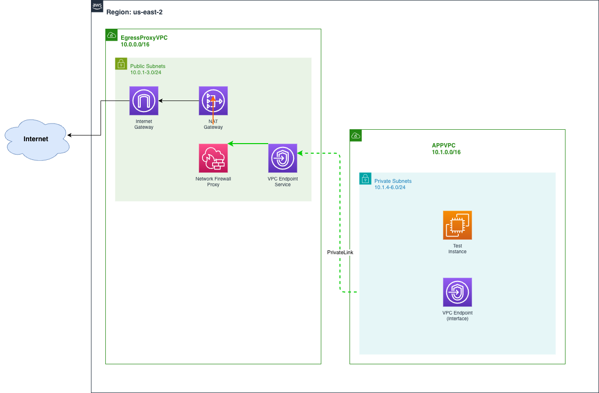

# AWS Network Firewall Proxy Lab

A hands-on lab for implementing centralised egress filtering using AWS Network Firewall Proxy.

## Table of Contents

1. [Introduction](#1-introduction)
2. [Solution Overview](#2-solution-overview)
3. [Deployment Guide](#3-deployment-guide)
4. [Testing the Setup](#4-testing-the-setup)
5. [Cleanup](#5-cleanup)
6. [Additional Resources](#6-additional-resources)

---

## 1. Introduction

### What is AWS Network Firewall Proxy?

On November 24, 2025, AWS announced [AWS Network Firewall Proxy](https://aws.amazon.com/about-aws/whats-new/2025/11/aws-network-firewall-proxy-preview/) in preview. This feature provides forward proxy capabilities integrated with NAT Gateways, enabling organizations to implement centralised, domain-based egress filtering without deploying and managing third-party proxy solutions.

### Key Benefits

| Benefit | Description |
|---------|-------------|
| **Centralised Egress Filtering** | Single point of control for all outbound internet traffic across multiple VPCs |
| **Domain-Based Controls** | Filter traffic based on destination domains using PreDNS rules |
| **Simplified Architecture** | Native AWS integration eliminates need for third-party proxy appliances |
| **Scalability** | Leverages AWS-managed NAT Gateway infrastructure |
| **Cost Optimization** | Reduces operational overhead of managing proxy servers |

### Use Cases

- **Compliance Requirements**: Restrict outbound access to approved domains only
- **Security Posture**: Prevent data exfiltration by blocking unauthorized destinations
- **SaaS Access Control**: Allow access only to approved SaaS applications
- **Development Environments**: Control which external resources developers can access

> **Note:** Network Firewall Proxy is a preview service limited to the us-east-2 (Ohio) region.

---

## 2. Solution Overview

### High-Level Architecture

This lab implements a hub-and-spoke egress architecture where:

1. **APPVPC** (spoke) hosts application workloads with no direct internet access
2. **EgressProxyVPC** (hub) provides centralized egress through NAT Gateway with NFW Proxy
3. Application traffic is routed through a VPC Endpoint to the NFW Proxy for domain filtering



### Traffic Flow

```
Test Instance (APPVPC Private Subnet)
         │
         ▼
VPC Endpoint (Interface)
         │
         ▼
Network Firewall Proxy ──────► Domain Filter Rules
         │                     (Allow: *.google.com, *.bbc.co.uk)
         ▼
NAT Gateway (EgressProxyVPC)
         │
         ▼
Internet Gateway
         │
         ▼
Internet
```

---

## 3. Deployment Guide

### Step 1: Clone Repository

```bash
git clone git@github.com:shirwahersi/aws-network-firewall-proxy-lab.git
cd aws-network-firewall-proxy-lab
```

### Step 2: Review and Customize Variables (Optional)

Edit `variables.tf` to customize:

```hcl
# Change region if needed
variable "aws_region" {
  default = "us-east-2"
}

# Update trusted IPs for bastion access
variable "bastion_trusted_ips" {
  default = ["YOUR_IP/32"]
}
```

### Step 3: Deploy Terraform Infrastructure

```bash
# Initialize Terraform
terraform init

# Review planned changes
terraform plan

# Deploy infrastructure
terraform apply
```

> **Note:** Save the outputs - you'll need them for SSH access.

### Step 4: Create Network Firewall Proxy Resources

The NFW Proxy is a preview feature and must be created via AWS CLI. Currently, there is no Terraform support for this feature.

#### 4a. Create Proxy Rule Group

```bash
aws network-firewall create-proxy-rule-group \
  --proxy-rule-group-name web-domain-filter \
  --description "egress domain filter" \
  --rules file://files/rules.json \
  --region us-east-2
```

#### 4b. Create Proxy Configuration

```bash
aws network-firewall create-proxy-configuration \
  --proxy-configuration-name "proxy-config" \
  --description "Proxy configuration" \
  --rule-group-names "web-domain-filter" \
  --default-rule-phase-actions PreDNS=DENY,PreREQUEST=ALLOW,PostRESPONSE=ALLOW \
  --region us-east-2
```

#### 4c. Get NAT Gateway ID

```bash
NGW_ID=$(aws ec2 describe-nat-gateways \
  --filter "Name=tag:Purpose,Values=egress-proxy" \
  --query "NatGateways[*].[NatGatewayId]" \
  --output text --region us-east-2)

echo "NAT Gateway ID: $NGW_ID"
```

#### 4d. Create Proxy

```bash
aws network-firewall create-proxy \
  --proxy-name "nfw-proxy" \
  --proxy-configuration-name "proxy-config" \
  --nat-gateway-id "$NGW_ID" \
  --listener-properties Port=1080,Type=HTTP Port=443,Type=HTTPS \
  --tls-intercept-properties "TlsInterceptMode=DISABLED" \
  --region us-east-2
```

> **Note:** This stage takes around 10-15 mins to complete.

### Step 5: Create VPC Endpoint for NFW Proxy

#### 5a. Get VPC Endpoint Service Name

```bash
aws network-firewall describe-proxy \
  --proxy-name "nfw-proxy" \
  --query "Proxy.VpcEndpointServiceName" \
  --output text --region us-east-2
```

#### 5b. Create VPC Endpoint (AWS Console)

1. Navigate to VPC > Endpoints > Create endpoint
2. Select "AWS services" category
3. Enter the VPC Endpoint Service Name from step 5a
4. Select APPVPC and private subnets
5. Attach the `vpc-endpoint-app-vpc-sg` security group

#### 5c. Note the VPC Endpoint DNS Name

After creation, note the endpoint DNS name (e.g., `vpce-xxxxx.proxy.nfw.us-east-2.vpce.amazonaws.com`).

---

## 4. Testing the Setup

### Connect to Test Instance

```bash
# Get connection details
terraform output

# SSH to test instance via bastion
ssh -i ~/.ssh/id_ed25519 -J ec2-user@<bastion_ip> ec2-user@<test_instance_ip>
```

### Configure Proxy Environment Variables

```bash
# Replace <vpce-endpoint> with your VPC Endpoint DNS name
# Note: we're routing both HTTP/HTTPS to proxy HTTP port 1080.
export HTTP_PROXY=http://<vpce-endpoint>:1080
export HTTPS_PROXY=http://<vpce-endpoint>:1080
export NO_PROXY='amazonaws.com,127.0.0.1,localhost'
```

### Test Allowed Domains

```bash
# Test google.com - should succeed
curl -I https://www.google.com

# Test bbc.co.uk - should succeed
curl -I https://www.bbc.co.uk
```

### Test Blocked Domains

```bash
# Test facebook.com - should be blocked
curl -I https://www.facebook.com

# Test github.com - should be blocked
curl -I https://www.github.com
```

Expected result: `HTTP/1.1 403 Forbidden` indicating domain is blocked.

---

## 5. Cleanup

###  5.1 Delete VPC Endpoint

Delete VPC Endpoint created in step 5b above.

### 5.2 Delete Network Firewall Proxy Resources

Delete in reverse order of creation:

```bash
# Delete the proxy
aws network-firewall delete-proxy \
  --proxy-name "nfw-proxy" \
  --nat-gateway-id "$NGW_ID" \
  --region us-east-2

# Wait for proxy deletion to complete
aws network-firewall describe-proxy \
  --proxy-name "nfw-proxy" \
  --region us-east-2

# Delete the proxy configuration
aws network-firewall delete-proxy-configuration \
  --proxy-configuration-name "proxy-config" \
  --region us-east-2

# Delete the proxy rule group
aws network-firewall delete-proxy-rule-group \
  --proxy-rule-group-name "web-domain-filter" \
  --region us-east-2
```

### 5.2 Destroy Terraform Infrastructure

```bash
terraform destroy
```

Type `yes` when prompted to confirm destruction.

---

## 6. Additional Resources

- [Deployment models for AWS Network Firewall](https://aws.amazon.com/blogs/networking-and-content-delivery/deployment-models-for-aws-network-firewall/)
- [Securing egress traffic using AWS Network Firewall](https://aws.amazon.com/blogs/networking-and-content-delivery/securing-egress-using-ids-ips-with-aws-network-firewall/)
